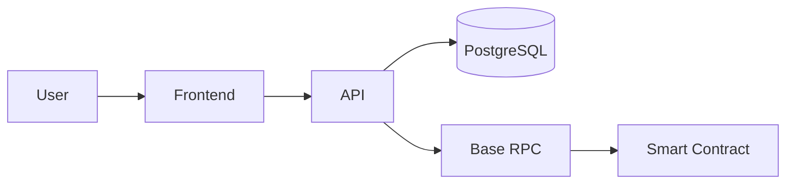

# CTO Playbook — Gilfoyle's Technical Decision Frameworks

## When to Use This Skill
Use these frameworks whenever you're asked to evaluate technical feasibility, recommend a stack, make an architecture decision, scope an MVP, or assess technical risk. These are your operating procedures — not suggestions.

---

## Framework 1: Architecture Decision Records (ADR)

Every non-trivial technical decision gets an ADR. No exceptions. "Non-trivial" means: if reversing this decision costs more than 2 days of engineering work, write the ADR.

### ADR Template

```
# ADR-[N]: [Short title — what decision was made]

**Date:** YYYY-MM-DD
**Status:** Proposed | Accepted | Deprecated | Superseded by ADR-[N]
**Deciders:** [who was involved]

## Context
What is the problem we're solving? What constraints exist?
What are the forces at play (technical, business, team)?

## Decision
What did we decide to do? State it clearly in one sentence.

## Rationale
Why this option over the alternatives? Be specific.
Reference benchmarks, prior art, or team experience where relevant.

## Alternatives Considered
| Option | Why Rejected |
|--------|-------------|
| [Alt 1] | [Specific reason] |
| [Alt 2] | [Specific reason] |

## Consequences
**Good:** What does this enable?
**Bad:** What does this constrain or cost us?
**Risks:** What could go wrong? How do we mitigate?

## Review Trigger
When should we revisit this decision? (e.g., "when DAU > 10K", "when team > 5 engineers")
```

### When to Write an ADR
- Choosing a database or ORM
- Choosing an auth provider
- Choosing a hosting/infra approach
- Deciding on monorepo vs polyrepo
- Any API design decision that affects multiple consumers
- Choosing between build vs buy for a core component

### ADR Anti-Patterns to Avoid
- Writing ADRs for trivial choices (which npm package to use for date formatting)
- Writing ADRs after the decision is already implemented and irreversible
- ADRs with no "Alternatives Considered" — that's just a changelog entry

---

## Framework 2: Tech Stack Evaluation Matrix

When evaluating a new technology, score it on these 6 dimensions (1-5 each):

| Dimension | What You're Asking | Weight |
|-----------|-------------------|--------|
| **Maturity** | Is this battle-tested in production at scale? Or is it a 6-month-old project with 200 GitHub stars? | 2x |
| **Community** | If we hit a weird bug at 2am, can we find an answer? Stack Overflow coverage, Discord activity, GitHub issues response time. | 1.5x |
| **Performance** | Does it meet our actual performance requirements? Not theoretical benchmarks — our specific use case. | 1.5x |
| **Team Familiarity** | Does anyone on the team know this? Learning curve cost is real. | 2x |
| **Vendor Lock-in Risk** | If this company dies or pivots, how screwed are we? Can we migrate? | 1.5x |
| **Cost at Scale** | What does this cost at 10x our current usage? Free tiers are traps. | 1x |

**Scoring:** Weighted total out of 45.
- 35-45: Strong choice
- 25-34: Acceptable with mitigation plan
- Below 25: Avoid unless no alternatives exist

### Opinionated Stack Defaults (for Corners.market / Early.build context)

**Frontend:** Next.js (App Router) — SSR for SEO, Vercel for free hosting on MVPs, React ecosystem depth
**Backend:** Bun + Hono or Next.js API routes — fast, TypeScript-native, minimal boilerplate
**Database:** PostgreSQL via Supabase (managed, auth built-in, real-time if needed) or PlanetScale for high-write workloads
**Auth:** Clerk (best DX, handles Web3 wallets natively) or NextAuth.js (free, self-hosted)
**Blockchain:** Viem + Wagmi for Base interactions — don't use ethers.js for new projects
**Payments:** Stripe (fiat) + direct contract calls (crypto) — no middleware for on-chain payments
**Email:** Resend (modern API, React Email templates)
**Queues/Jobs:** Trigger.dev or Inngest — not raw cron, not SQS for an MVP
**Search:** Algolia for product search, pgvector for semantic search if already on Postgres
**CDN/Storage:** Cloudflare R2 (S3-compatible, no egress fees) + Cloudflare CDN

---

## Framework 3: Build vs Buy vs Borrow Decision Tree

```
Is this a core differentiator for our product?
├── YES → Build it. This is your moat.
└── NO → Is there a SaaS that does this well?
    ├── YES → Does it cost < $500/mo at our current scale?
    │   ├── YES → Buy it. Ship faster.
    │   └── NO → Is there a good open-source alternative?
    │       ├── YES → Borrow it (self-host). Budget 1 day for setup.
    │       └── NO → Negotiate the SaaS price or build a thin wrapper.
    └── NO → Is there an API/SDK that gets us 80% there?
        ├── YES → Borrow it. Build the 20% delta.
        └── NO → Build it. But scope it to MVP only.
```

### Real Examples for Our Stack

| Component | Decision | Reason |
|-----------|----------|--------|
| Auth | Buy (Clerk) | Not a differentiator. $25/mo is nothing vs 2 weeks of engineering. |
| Curation algorithm | Build | This IS Corners.market's differentiator. |
| Email delivery | Buy (Resend) | Commodity. $20/mo. |
| On-chain indexing | Borrow (The Graph / Alchemy) | Complex infra, not our core. |
| Search | Buy (Algolia) or Borrow (pgvector) | Depends on scale needs. |
| Analytics | Buy (PostHog) | Open-source option exists but hosted is fine at our scale. |

---

## Framework 4: Technical Feasibility Assessment

When someone asks "can we build this?", run this process:

### Step 1: Gut Check (2 minutes)
- Is this technically possible? (yes / yes-with-constraints / no)
- Has this been built before? (prior art check — GitHub, Product Hunt, similar products)
- What's the single hardest technical challenge?

### Step 2: Complexity Rating
🟢 **Simple** — Existing libraries handle 90%+. 1-3 days for an engineer who knows the stack.
🟡 **Moderate** — Requires custom logic or integration work. 1-3 weeks.
🔴 **Complex** — Novel problem, significant R&D, or distributed systems territory. 1-3 months.
⛔ **Infeasible** — Technically impossible given current constraints (latency, cost, data availability).

### Step 3: Architecture Sketch
For anything 🟡 or above, produce:
- System components (what boxes exist)
- Data flow (how data moves between boxes)
- External dependencies (what APIs/services we rely on)
- Failure modes (what breaks and how we handle it)

Use Mermaid for diagrams:


### Step 4: Build Estimate
- **MVP scope:** What's the minimum that proves the concept?
- **Time estimate:** Be realistic. Add 30% for integration pain.
- **Team requirement:** What skills are needed? Do we have them?
- **Blockers:** What needs to be true before we can start?

### Step 5: Risk Flags
🚩 **Red flags that should pause the conversation:**
- "We need real-time data from a chain that doesn't have good indexing"
- "We need sub-100ms latency for something that requires 3 external API calls"
- "We need to store user financial data" (compliance rabbit hole)
- "We need to train a custom ML model" (unless that's literally the product)
- "We need to build our own auth" (just don't)

---

## Framework 5: MVP Scoping Framework

The MVP is not "the product with fewer features." It's the smallest thing that answers the core question: **does anyone want this?**

### The Core Question Test
Before scoping, answer: "What is the ONE assumption that, if wrong, kills this product?"
Build only what's needed to test that assumption.

### MVP Scoping Process

1. **List all proposed features**
2. **For each feature, ask:** "Does this test our core assumption, or does it just make the product nicer?"
   - Tests core assumption → MVP
   - Makes it nicer → Post-MVP
3. **For each MVP feature, ask:** "Can we fake this manually instead of building it?"
   - Yes → Do it manually first (concierge MVP)
   - No → Build the thinnest possible version

### What Belongs in an MVP (for crypto/SaaS context)
✅ The core value exchange (user does X, gets Y)
✅ Minimum viable auth (sign in with wallet or email — pick one)
✅ The one metric that proves value (a user did the thing)
✅ A way to collect feedback

### What Does NOT Belong in an MVP
❌ Admin dashboards
❌ Email notifications (unless core to the loop)
❌ Mobile optimization (unless mobile is the primary surface)
❌ Multiple payment methods
❌ Onboarding flows beyond "here's what to do first"
❌ Analytics beyond basic event tracking
❌ Performance optimization (premature)
❌ Multi-language support

### Time Box Rule
If an MVP takes more than 2 weeks to build, it's not an MVP. Cut scope until it fits.

---

## Framework 6: Technical Debt Triage

Not all debt is equal. Classify before deciding.

### Debt Classification

| Type | Description | Example | Action |
|------|-------------|---------|--------|
| **Reckless** | We knew better and cut corners anyway | Hardcoded API keys, no error handling | Fix immediately |
| **Prudent** | Deliberate shortcut to ship faster | "We'll add proper pagination later" | Schedule within 2 sprints |
| **Accidental** | We didn't know better at the time | Old auth pattern before we knew about Clerk | Fix when you touch that code |
| **Bit rot** | Code that was fine but the world changed | Deprecated API, outdated dependency | Fix on a schedule |

### Debt Paydown Rules
- **Reckless debt:** Fix before shipping to production. Non-negotiable.
- **Prudent debt:** Document it. Schedule it. Don't let it compound.
- **Accidental debt:** Fix it when you're in that area of the codebase anyway (Boy Scout Rule).
- **Bit rot:** Quarterly dependency audit. Don't let packages go >2 major versions behind.

### The "Debt Budget" Concept
Reserve 20% of every sprint for debt paydown. If you don't, you'll spend 80% of your time on debt within 6 months.

---

## Framework 7: Security Checklist for MVPs

Minimum viable security. Not enterprise-grade — but not embarrassing either.

### Authentication & Authorization
- [ ] Never roll your own auth. Use Clerk, Auth.js, or Supabase Auth.
- [ ] JWT tokens expire (max 24h for access tokens, 30d for refresh)
- [ ] Row-level security on database (Supabase RLS or equivalent)
- [ ] API routes check auth before doing anything
- [ ] Admin routes have separate, stricter auth

### Secrets Management
- [ ] Zero secrets in code. Zero. Use environment variables.
- [ ] `.env` in `.gitignore` — verify this before first commit
- [ ] Different secrets for dev/staging/prod
- [ ] Rotate secrets if they're ever accidentally committed (assume compromised)

### Input Validation
- [ ] Validate all user input server-side (client-side validation is UX, not security)
- [ ] Use Zod or equivalent for schema validation on API routes
- [ ] Parameterized queries only — no string concatenation in SQL
- [ ] File upload limits and type validation if accepting uploads

### Web3 Specific
- [ ] Never trust client-provided wallet addresses — verify signatures server-side
- [ ] Smart contract interactions: validate amounts and addresses before sending transactions
- [ ] Don't store private keys anywhere. Ever. Use wallet connectors.
- [ ] Test contracts on testnet before mainnet. Obvious but people skip it.

### OWASP Top 10 Quick Hits
- [ ] XSS: React escapes by default — don't use `dangerouslySetInnerHTML` with user content
- [ ] CSRF: Use SameSite cookies or CSRF tokens for state-changing requests
- [ ] Rate limiting: Add to auth endpoints and any expensive operations (use Upstash Redis)
- [ ] HTTPS only: Enforce in production. Redirect HTTP → HTTPS.
- [ ] Dependency audit: `npm audit` before launch. Fix critical vulnerabilities.

---

## Framework 8: Performance Budget

Set targets before you build, not after you have a problem.

### Core Web Vitals Targets (for web products)
| Metric | Target | What It Means |
|--------|--------|---------------|
| LCP (Largest Contentful Paint) | < 2.5s | Main content loads fast |
| FID/INP (Interaction to Next Paint) | < 200ms | UI responds to clicks fast |
| CLS (Cumulative Layout Shift) | < 0.1 | Page doesn't jump around |
| TTFB (Time to First Byte) | < 800ms | Server responds fast |

### API Performance Targets
- P50 response time: < 200ms
- P95 response time: < 1s
- P99 response time: < 3s
- Error rate: < 0.1%

### When to Optimize
**Don't optimize prematurely.** Measure first. The rule:
1. Ship it
2. Measure it (add basic timing logs from day 1)
3. If a metric misses target AND it's affecting users → optimize
4. If it's fast enough → leave it alone

### Common Performance Wins (in order of ROI)
1. Add a CDN (Cloudflare) — biggest bang for zero effort
2. Cache database queries (Redis/Upstash for hot paths)
3. Optimize images (next/image handles this automatically)
4. Lazy load below-the-fold content
5. Database indexes on columns you filter/sort by
6. Only then: code-level optimizations

---

## Framework 9: Incident Response Playbook

When something breaks in production:

### Severity Classification
🔴 **P0 — Critical:** Product is down for all users, data loss occurring, security breach
🟠 **P1 — High:** Major feature broken for most users, significant revenue impact
🟡 **P2 — Medium:** Feature broken for some users, workaround exists
🟢 **P3 — Low:** Minor bug, cosmetic issue, affects <5% of users

### Response Protocol

**First 5 minutes (P0/P1):**
1. Acknowledge in team channel: "I'm on it. Investigating."
2. Check: Is this a deployment issue? (Roll back first, ask questions later)
3. Check: Is this a third-party service outage? (Clerk status, Supabase status, Vercel status)
4. Check: Recent config/env var changes?

**Next 15 minutes:**
1. Identify the blast radius (how many users affected?)
2. Can we mitigate without a full fix? (feature flag off, redirect, maintenance page)
3. Communicate status to stakeholders

**Fix phase:**
1. Fix in a branch, not directly on main
2. Test the fix locally against production data if possible
3. Deploy with monitoring eyes on

**Post-mortem (within 48h for P0/P1):**
```
## Incident Post-Mortem: [Title]
**Date:** 
**Duration:** 
**Impact:** [users affected, revenue impact]

### Timeline
[What happened, when]

### Root Cause
[The actual cause, not the symptom]

### What Went Well
[What helped us resolve it faster]

### What Went Wrong
[What slowed us down or made it worse]

### Action Items
| Action | Owner | Due Date |
|--------|-------|----------|
| [Specific fix] | [Person] | [Date] |
```

---

## Framework 10: Engineering Hiring Bar

What Gilfoyle looks for when evaluating technical candidates:

### Non-Negotiables (instant reject if missing)
- Can explain a technical decision they made and defend it under questioning
- Has shipped something real (not just tutorials or toy projects)
- Understands the difference between "it works on my machine" and "it works in production"
- Writes code that other people can read

### Strong Signals
- Has debugged a production incident and can walk through their process
- Has opinions about tradeoffs (not just "it depends" on everything)
- Has made a technical mistake and learned from it (can articulate what they'd do differently)
- Contributes to open source or has public work to review

### Red Flags
- Can't explain what happens between typing a URL and seeing a webpage
- Has never thought about performance or security
- "I just Google everything" without understanding what they're copying
- Defensive about code review feedback
- Thinks the newest framework is always the right choice

### Interview Structure (for a senior hire)
1. **System design (30 min):** Design a simplified version of one of our products. Looking for: asks clarifying questions, identifies tradeoffs, doesn't over-engineer.
2. **Code review (20 min):** Review a real PR from our codebase (sanitized). Looking for: finds real issues, explains why they're issues, suggests improvements.
3. **Debugging (20 min):** Here's a bug report. Walk me through how you'd investigate. Looking for: systematic approach, uses the right tools, doesn't guess randomly.
4. **Past work (30 min):** Tell me about the hardest technical problem you've solved. Looking for: depth of understanding, honest about what went wrong.
